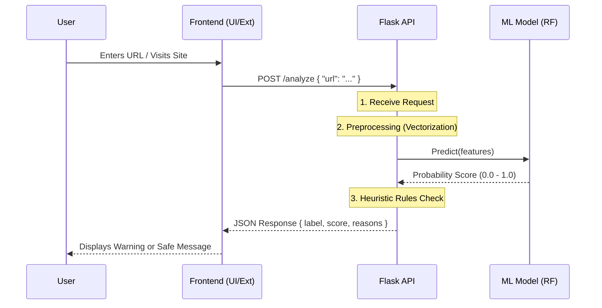

# System Architecture & Workflow

This document explains the technical architecture and data flow of the AI-Enabled Phishing URL Detector.

## 1. High-Level Workflow

The system follows a standard client-server architecture where a frontend (or extension) sends URLs to a Python Flask backend for analysis. The backend uses a trained Machine Learning model to predict if the URL is phishing or safe.

## 2. Component Details

### A. Frontend (`frontend/`)
- **Technology**: HTML, CSS, Vanilla JavaScript.
- **Role**:
    - Accepts user input (URL).
    - Validates the input.
    - Sends an asynchronous `fetch()` request to the Backend API.
    - Displays the result (Safe/Suspicious/Malicious) with a confidence score.

### B. Backend API (`backend/app_flask.py`)
- **Technology**: Python, Flask, Gunicorn.
- **Endpoints**:
    - `GET /`: Health check.
    - `POST /analyze`: Main analysis endpoint.
- **Logic**:
    1.  **Input**: Receives JSON payload `{"url": "http://..."}`.
    2.  **Vectorization**: Converts the URL string into numerical features using `TfidfVectorizer` (loaded from `vectorizer.pkl`).
    3.  **Prediction**: Uses the `RandomForestClassifier` (loaded from `model.pkl`) to get a probability score.
    4.  **Heuristics**: Runs `explain_from_url()` to check for common phishing patterns (e.g., presence of `@`, IP addresses, excessive length).
    5.  **Output**: Returns a combined verdict.

### C. Machine Learning Model (`backend/train_real.py`)
- **Algorithm**: Random Forest Classifier.
- **Features**: TF-IDF (Term Frequency-Inverse Document Frequency) of character n-grams in the URL.
- **Training Data**:
    - **Phishing**: `data/openphish_raw.txt`
    - **Benign**: `data/benign_raw.csv` (Alexa Top 1M subset)
- **Artifacts**:
    - `model.pkl`: The trained classifier.
    - `vectorizer.pkl`: The fitted TF-IDF object (must match training exactly).

## 3. Deployment Flow

When code is pushed to the `main` branch:
1.  **Git Trigger**: The repository updates on GitHub.
2.  **Render/Heroku**: Detects the change.
3.  **Build**:
    - Installs dependencies from `backend/requirements.txt`.
    - No build step for Python, just setup.
4.  **Start**:
    - Runs `gunicorn app_flask:app`.
    - `app_flask.py` loads `model.pkl` and `vectorizer.pkl` using absolute paths.
5.  **Live**: The API becomes available at the hosted URL.

## 4. Directory Structure Explanation

| Directory | Description |
| :--- | :--- |
| `backend/` | Contains the Flask app, training scripts, and ML artifacts (`.pkl` files). |
| `frontend/` | simple static website for testing the API. |
| `data/` | Raw datasets and scripts (`prepare_and_train.ps1`) to process them. |
| `docs/` | This documentation. |
